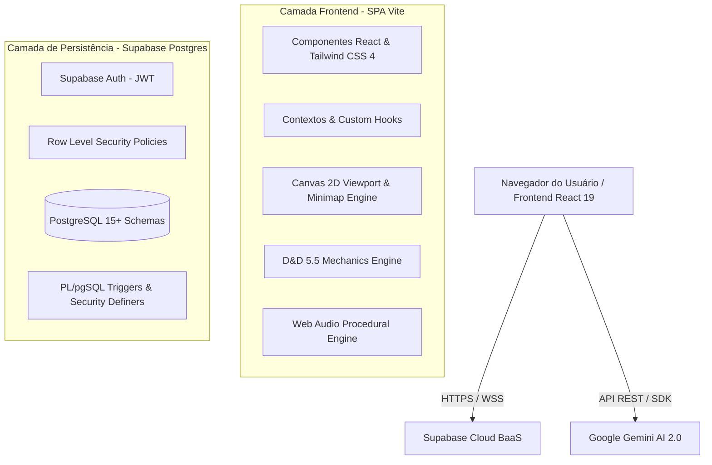
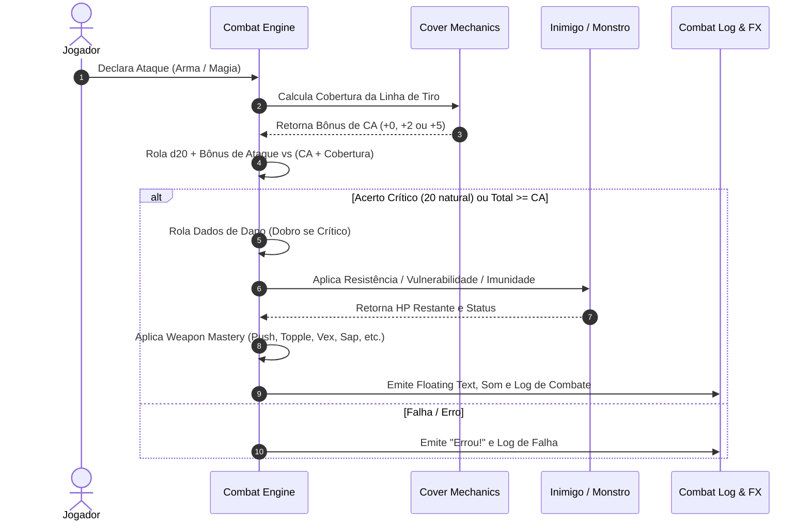
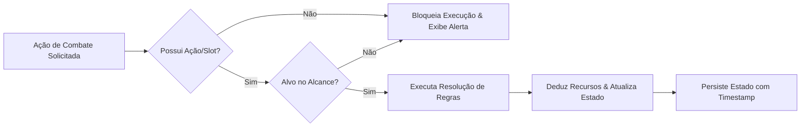

# 📜 D&D 5.5 Web RPG — Documento de Escopo Completo & Diretrizes de Segurança

> **Versão do Documento:** 1.0.0  
> **Sistema Base:** Dungeons & Dragons 5.5 (Edição 2024)  
> **Status:** Ativo / Em Produção & Desenvolvimento Contínuo  
> **Ambiente:** Web / SPA (React 19 + TypeScript + Supabase + Canvas Engine + Gemini AI)

---

## 📑 Índice Geral

1. [Visão Geral e Objetivos do Projeto](#1-visão-geral-e-objetivos-do-projeto)
2. [Arquitetura de Software e Stack Tecnológica](#2-arquitetura-de-software-e-stack-tecnológica)
3. [Mapeamento Completo de Escopo e Módulos (Detalhe a Detalhe)](#3-mapeamento-completo-de-escopo-e-módulos-detalhe-a-detalhe)
   - [3.1 Módulo de Autenticação, Usuários e RBAC](#31-módulo-de-autenticação-usuários-e-rbac)
   - [3.2 Módulo de Criação de Personagens (Wizard D&D 5.5)](#32-módulo-de-criação-de-personagens-wizard-dd-55)
   - [3.3 Módulo da Ficha de Personagem (Character Sheet & Engine)](#33-módulo-da-ficha-de-personagem-character-sheet--engine)
   - [3.4 Módulo de Catálogo, Regras e Compêndio D&D 5.5](#34-módulo-de-catálogo-regras-e-compêndio-dd-55)
   - [3.5 Módulo do Motor de Mundo 2D Procedural e Exploração](#35-módulo-do-motor-de-mundo-2d-procedural-e-exploração)
   - [3.6 Módulo do Motor de Combate Tático por Turnos](#36-módulo-do-motor-de-combate-tático-por-turnos)
   - [3.7 Módulo de Inteligência Artificial de Monstros (IA & Pathfinding)](#37-módulo-de-inteligência-artificial-de-monstros-ia--pathfinding)
   - [3.8 Módulo de Sobrevivência, Clima e Ciclo Dia/Noite](#38-módulo-de-sobrevivência-clima-e-ciclo-dianoite)
   - [3.9 Módulo de Áudio Procedural e Efeitos Visuais](#39-módulo-de-áudio-procedural-e-efeitos-visuais)
   - [3.10 Módulo de Integração com IA Generativa (Gemini AI)](#310-módulo-de-integração-com-ia-generativa-gemini-ai)
4. [Framework de Segurança e Prevenção de Problemas Futuros](#4-framework-de-segurança-e-prevenção-de-problemas-futuros)
   - [4.1 Segurança no Banco de Dados (PostgreSQL & Supabase RLS)](#41-segurança-no-banco-de-dados-postgresql--supabase-rls)
   - [4.2 Segurança contra Elevação de Privilégios e Controle de Papéis](#42-segurança-contra-elevação-de-privilégios-e-controle-de-papéis)
   - [4.3 Validação de Dados, Schemas Estritos e Sanitização](#43-validação-de-dados-schemas-estritos-e-sanitização)
   - [4.4 Integridade de Estado e Prevenção contra Cheating no Cliente](#44-integridade-de-estado-e-prevenção-contra-cheating-no-cliente)
   - [4.5 Gestão Segura de Chaves, Variáveis de Ambiente e Segredos](#45-gestão-segura-de-chaves-variáveis-de-ambiente-e-segredos)
   - [4.6 Resiliência, Fallback Offline e Tratamento de Erros](#46-resiliência-fallback-offline-e-tratamento-de-erros)
   - [4.7 Prevenção de Vazamento de Memória (Memory Leaks) & Performance](#47-prevenção-de-vazamento-de-memória-memory-leaks--performance)
5. [Matriz de Riscos Técnicos e Planos de Mitigação](#5-matriz-de-riscos-técnicos-e-planos-de-mitigação)
6. [Regras de Desenvolvimento, Padrões de Código e Versionamento](#6-regras-de-desenvolvimento-padrões-de-código-e-versionamento)
7. [Checklist de Auditoria Pré-Deploy e Manutenção](#7-checklist-de-auditoria-pré-deploy-e-manutenção)

---

## 1. Visão Geral e Objetivos do Projeto

O **D&D 5.5 Web RPG** é uma aplicação web completa de RPG tático e gestão de personagens baseada nas regras oficiais do **Dungeons & Dragons 2024 (5.5 Edition)**. 

### Objetivos Centrais:
1. **Fidelidade às Regras:** Implementar com precisão matemática as mecânicas do livro do jogador (Player's Handbook 2024), abrangendo progressão de nível 1 ao 20, cálculo de Classe de Armadura (CA), Maestrias de Armas (*Weapon Masteries*), Talentos de Origem/Épicos, magias e recursos de classe.
2. **Exploração Procedural Imersiva:** Oferecer exploração top-down 2D em grid ortogonal com geração de mapa infinita baseada em sementes (*seeds*), ruído simplex (*simplex noise*), biomas variados, obstáculos dinâmicos, armadilhas e névoa de guerra (*fog of war*).
3. **Combate Tático por Turnos:** Proporcionar um sistema de combate tático de alta precisão com rolagem de dados em tempo real, inteligência artificial com pathfinding $A^*$, mecânicas de cobertura, ataques de oportunidade e regras completas de condições e danos.
4. **Segurança e Estabilidade a Longo Prazo:** Garantir que o sistema opere com Row Level Security (RLS) impenetrável, validações de integridade, imunidade a falhas de conexão, tratamento robusto de erros e prevenção de corrupção de estado.

---

## 2. Arquitetura de Software e Stack Tecnológica



### Componentes Tecnológicos:
- **Core Frontend:** React 19, TypeScript ~5.8, Vite 6.
- **Estilização e UI:** Tailwind CSS v4, Lucide React (ícones vetoriais), Motion (animações de transição e modais).
- **Renderização Gráfica:** HTML5 Canvas API acelerada via hardware para mapa procedural, entidades, iluminação dinâmica, partículas e minimapa.
- **Backend as a Service (BaaS):** Supabase (PostgreSQL 15+, Auth JWT, Row Level Security, Triggers e Stored Procedures).
- **Inteligência Artificial:** `@google/genai` (SDK oficial do Google Gemini 2.x).
- **Áudio Sintético:** Web Audio API nativo com sintetizador procedural de ondas sonoras para efeitos sonoros e ambientação.
- **Testes e Qualidade:** Vitest, TypeScript Type Checking (`tsc --noEmit`).

---

## 3. Mapeamento Completo de Escopo e Módulos (Detalhe a Detalhe)

---

### 3.1 Módulo de Autenticação, Usuários e RBAC
*Arquivos principais:* `src/components/auth/LoginScreen.tsx`, `src/lib/api/authService.ts`, `src/components/admin/UserManagementTab.tsx`, `src/types/auth.ts`.

- **Autenticação Segura:** Login, cadastro com e-mail/senha, validação de formato e recuperação de sessão automática.
- **Modelo de Usuário (`app_users`):**
  - Campos: `id` (UUID vinculado a `auth.users`), `username` (único), `name`, `role` (`jogador` ou `administrador`), `created_at`.
- **Sincronização por Triggers:** Criação automática do registro em `public.app_users` via trigger `on_auth_user_created` imediatamente após cadastro no `auth.users`.
- **Painel Administrativo:**
  - Visualização de todos os usuários cadastrados e estatísticas de uso.
  - Auditoria de perfis e personagens vinculados.
  - Alteração de papéis com trava de segurança em nível de banco de dados.

---

### 3.2 Módulo de Criação de Personagens (Wizard D&D 5.5)
*Arquivos principais:* `src/components/character/CharacterCreation.tsx`, `src/components/character/creation/*`.

Fluxo estruturado em 10 etapas sequenciais com validação passo a passo:
1. **Seleção de Espécie (Raça/Variante):** Atribuição automática de velocidade, tamanho, tipo de criatura, visão no escuro e traços raciais específicos (ex.: *Breath Weapon* de Draconatos, *Relentless Endurance* de Meio-Orcs, *Giant Ancestry* de Golias).
2. **Seleção de Antecedente (Background):** Distribuição de +2/+1 ou +1/+1/+1 nos atributos de acordo com o antecedente, proficiências em perícias, proficiência em ferramentas e concessão do Talento de Origem (*Origin Feat*).
3. **Seleção de Classe & Subclasse:** Dado de vida (*Hit Die*), proficiências de classe (armas, armaduras, salvaguardas), habilidades de nível 1 e preparação de recursos.
4. **Distribuição de Atributos:**
   - Suporte a métodos: *Point Buy* (27 pontos), *Standard Array* (15, 14, 13, 12, 10, 8) e Rolagem Manual.
   - Aplicação em tempo real dos bônus de antecedente.
5. **Seleção de Perícias & Ferramentas:** Respeito rigoroso aos limites e listas de perícias permitidas pela classe e raça.
6. **Seleção de Talentos Adicionais:** Suporte a talentos de origem e talentos gerais com pré-requisitos de atributo e nível.
7. **Seleção de Magias Iniciais / Truques:** Filtragem por lista de classe, slots disponíveis e regras de preparação da edição 2024.
8. **Seleção de Equipamento Inicial:** Escolha entre Pacotes Oficiais (Opção A ou B) ou Ouro Inicial para compra livre.
9. **Detalhes Biográficos:** Nome, alinhamento, divindade, traços de personalidade, aparência e notas de histórico.
10. **Revisão Final e Persistência:** Validação de integridade do payload antes do envio para a tabela `characters` e tabelas dependentes.

---

### 3.3 Módulo da Ficha de Personagem (Character Sheet & Engine)
*Arquivos principais:* `src/components/character/CharacterSheet.tsx`, `src/components/character/sheet/*`, `src/lib/mechanics/*`.

- **Cálculo Dinâmico de Classe de Armadura (`acCalculator.ts`):**
  - Suporte a armaduras leves, médias (com teto de +2 de DES) e pesadas (sem DES).
  - Escudos (+2 CA).
  - Defesa Sem Armadura de Bárbaro ($10 + \text{DES} + \text{CON}$) e Monge ($10 + \text{DES} + \text{SAB}$).
  - Talentos defensivos (*Defensive Duelist*, *Dual Wielder*, *Fighting Style: Defense*).
- **Gestão Precisa de Pontos de Vida (`hpCalculator.ts` & `HpAuditModal.tsx`):**
  - Cálculo de HP Máximo por nível: $\text{Dado de Vida Cheio no Lv 1} + \text{Média/Rolagem nos níveis subsequentes} + (\text{Modificador de CON} \times \text{Nível}) + \text{Talentos (Tough)}$.
  - Controle de HP Atual, HP Temporário (não cumulativo), Exaustão (níveis 1 a 6) e Testes contra a Morte (*Death Saves*).
- **Motor de Subida de Nível (`useLevelUpEngine.ts` & `LevelUpModal.tsx`):**
  - Progressão do Nível 1 ao 20 com incremento automático do Bônus de Proficiência (PB: +2 a +6).
  - Desbloqueio automático de novas características de classe, espaços de magia (*Spell Slots*) e escolhas de subclasse no nível correspondente.
  - Aumento no Valor de Habilidade (ASI) ou escolha de Novos Talentos nos níveis 4, 8, 12, 16 e 19.
- **Gestão de Descansos (`restManager.ts`):**
  - **Descanso Curto (Short Rest):** Gasto de dados de vida para cura e recuperação de recursos baseados em descanso curto (ex.: *Second Wind*, *Ki/Focus Points*, *Warlock Spell Slots*, *Channel Divinity*).
  - **Descanso Longo (Long Rest):** Recuperação total de HP, recuperação de metade do total de Dados de Vida, reset de slots de magia e remoção de 1 nível de exaustão.
- **Inventário em Grade com Slots de Equipamento (`useEquipmentSlots.ts`):**
  - Slots: Cabeça, Armadura/Tronco, Mão Principal (*Main Hand*), Mão Secundária (*Off Hand*), Botas, Capa, Anéis e Amuletos.
  - Cálculo contínuo de peso total carregado e capacidade máxima ($15 \times \text{Força}$ em libras).
  - Gestão monetária de 5 moedas: Cobre (CP), Prata (SP), Electro (EP), Ouro (GP) e Platina (PP) com conversão automática.

---

### 3.4 Módulo de Catálogo, Regras e Compêndio D&D 5.5
*Arquivos principais:* `src/components/shared/*`, `src/lib/api/*Service.ts`.

Compêndio completo e interativo com busca instantânea, filtros e paginação:
- **Classes:** 12 classes com tabelas completas de progressão, características de nível, subclasses e dados de vida.
- **Raças:** Todas as espécies oficiais D&D 5.5 com variantes, velocidades e traços raciais detalhados.
- **Magias:** Mais de 300 magias cadastradas do nível 0 ao 9, com tempo de conjuração, alcance, componentes (V, S, M), duração, escola e classes aptas.
- **Itens & Armas:** Armas simples e marciais com propriedades oficiais (Versátil, Leve, Finesse, Duas Mãos, Alcance, Pesada, Arremesso) e Maestrias de Armas.
- **Talentos:** Talentos de Origem, Talentos Gerais e Dádivas Épicas (*Epic Boons* de Lv 19+).
- **Bestiário:** Catálogo completo de monstros com Nível de Desafio (CR 0 a 30), atributos, CA, HP, resistências, imunidades e blocos de ações.
- **Regras do Jogo & Implementações:** Visualizador de regras da edição 2024 e roadmap de funcionalidades com status em tempo real.

---

### 3.5 Módulo do Motor de Mundo 2D Procedural e Exploração
*Arquivos principais:* `src/game/world/*`, `src/components/game/hooks/useArenaExploration.ts`, `src/components/game/renderer/*`.

- **Arquitetura Baseada em Chunks:**
  - Divisão do mundo em grades de $16 \times 16$ células com coordenadas globais $(X, Y)$.
  - Cache dinâmico de chunks com carregamento e descarregamento sob demanda para otimização de memória.
- **Geração Procedural Determinística por Seed:**
  - Gerador pseudoaleatório (PRNG) com algoritmo Mulberry32 / PCG.
  - Ruído Simplex 2D em múltiplas oitavas para determinar elevação, umidade e tipo de bioma.
- **Biomas Dinâmicos:**
  - Floresta Densa, Cavernas Rochosas, Deserto Árido, Criptas / Masmorras, Pântano Tóxico e Ruínas Antigas.
- **Camadas de Terreno e Obstáculos:**
  - Células normais (Custo 1) e Terreno Difícil (Custo 2 - lama, teias, água rasa).
  - Obstáculos multidimensionais ($1\times 1, 2\times 2, 3\times 3$): Árvores gigantes, pilares, rochas, paredes e grades.
  - Armadilhas ocultas e visíveis com DC de Percepção Passiva para detecção e Salvaguardas para redução de dano.
- **Sistema de Visão e Fog of War:**
  - Iluminação dinâmica baseada na posição do jogador, tochas e visão no escuro (*Darkvision*).
  - Células não exploradas (pretas), exploradas mas fora de visão (cinza / sombra) e células no campo de visão ativo (totalmente visíveis e coloridas).

---

### 3.6 Módulo do Motor de Combate Tático por Turnos
*Arquivos principais:* `src/game/combatEngine.ts`, `src/components/game/hooks/heroCombat/*`, `src/components/game/hooks/platform/*`.



- **Economia de Ações por Turno (D&D 5.5):**
  - **Movimento:** Deslocamento baseado no *Speed* do personagem (convertido para células de 5 pés).
  - **Ação Principal:** Atacar, Conjurar Magia, Disparada (*Dash*), Esquivar (*Dodge*), Desengajar (*Disengage*), Esconder-se (*Hide*), Ajudar (*Help*), Usar Item.
  - **Ação Bônus:** Magias de ação bônus, habilidades de classe (*Second Wind*, *Cunning Action*, *Rage*), ataques com mão secundária.
  - **Reação:** Ataques de Oportunidade, Magias de Reação (*Shield*, *Hellish Rebuke*, *Absorb Elements*).
- **Mecânicas de Ataque e Dano Avançadas:**
  - Parser de dados dinâmico (`rollDiceString`) suportando equações como `2d6+1d4+3`.
  - Resolução de Acerto Crítico (20 natural) e Falha Crítica (1 natural).
  - Resistências, Vulnerabilidades e Imunidades para todos os 13 tipos de dano oficiais (Cortante, Perfurante, Concussão, Fogo, Frio, Elétrico, Ácido, Veneno, Necrótico, Radiante, Psíquico, Força, Trovejante).
- **Maestrias de Armas (Weapon Masteries):**
  - **Cleave:** Golpe extra em inimigo adjacente.
  - **Graze:** Causa dano igual ao modificador do atributo mesmo se errar o ataque.
  - **Nick:** Ataque extra de mão secundária conta como parte da Ação de Ataque em vez de gastar Ação Bônus.
  - **Push:** Empurra o alvo 10 pés (2 células) em linha reta se acertar.
  - **Sap:** Impõe desvantagem no próximo ataque do alvo.
  - **Slow:** Reduz o movimento do alvo em 10 pés até o próximo turno.
  - **Topple:** Força salvaguarda de Constituição para não cair derrubado (*Prone*).
  - **Vex:** Concede vantagem no próximo ataque contra o mesmo alvo.
- **Sistema de Cobertura Dinâmica (`coverMechanics.ts`):**
  - Meia Cobertura (+2 na CA e Salvaguardas de Destreza).
  - Três Quartos de Cobertura (+5 na CA e Salvaguardas de Destreza).
  - Cobertura Total (Impossibilidade de ser alvo direto).
- **Ataques de Oportunidade:**
  - Gatilho automático quando uma entidade se desloca para fora do alcance de ameaça corpo a corpo sem utilizar a ação *Desengajar*.

---

### 3.7 Módulo de Inteligência Artificial de Monstros (IA & Pathfinding)
*Arquivos principais:* `src/game/monsterAI.ts`, `src/game/aStarPathfinding.ts`, `src/components/game/hooks/useMonsterTurnAI.ts`.

- **Algoritmo de Navegação $A^*$ Otimizado:**
  - Cálculo da rota mais curta respeitando custos de terreno e obstáculos intransponíveis.
  - Detecção e desvio de aliados e armadilhas conhecidas.
- **Comportamentos Táticos Diferenciados por Arquétipo:**
  - **Corpo a Corpo Agressivo:** Persegue o alvo com menor CA/HP, aproxima-se e executa múltiplos ataques.
  - **Arqueiro / Longo Alcance:** Mantém distância ótima de disparo, recua se o jogador se aproximar e busca posições com cobertura.
  - **Conjurador / Suporte:** Lança magias de área, debuffs no jogador e cura ou fortalece aliados feridos.
  - **Furtivo / Emboscador:** Tenta flanquear e utilizar ataques com vantagem para aplicar bônus de dano.

---

### 3.8 Módulo de Sobrevivência, Clima e Ciclo Dia/Noite
*Arquivos principais:* `src/game/weatherEffects.ts`, `src/components/game/hooks/useSurvivalNeeds.ts`, `src/components/game/hooks/platform/useDayNightCycle.ts`.

- **Ciclo Dia/Noite Contínuo:** Transição suave de iluminação e visibilidade baseada no relógio interno da sessão (Manhã, Meio-dia, Tarde, Crepúsculo, Noite e Madrugada).
- **Efeitos Climáticos Procedurais:**
  - **Chuva e Tempestade:** Reduz visibilidade, extingue tochas e cria poças de terreno difícil.
  - **Névoa Espessa:** Impõe desvantagem em ataques à distância e reduz o raio de visão pela metade.
  - **Onda de Calor / Frio Extremo:** Exige salvaguardas periódicas contra exaustão caso o personagem não tenha abrigo ou suprimentos adequados.
- **Necessidades de Sobrevivência:**
  - Controle de Fome, Sede e Fadiga com penalidades progressivas se negligenciadas durante longas viagens.

---

### 3.9 Módulo de Áudio Procedural e Efeitos Visuais
*Arquivos principais:* `src/lib/audio.ts`, `src/components/game/hooks/platform/useArenaVisualFX.ts`.

- **Áudio 100% Procedural e Leve:**
  - Geração de efeitos sonoros em tempo real via Web Audio API (ataques com espada, disparos de flecha, explosões de fogo, passos em diferentes tipos de solo, cura mágica e cliques de interface).
  - Trilha sonora ambiente gerada algoritmicamente baseada no bioma atual e no estado de tensão (Exploração relaxada vs Combate iminente).
- **Efeitos Visuais e Feedback Imediato:**
  - Textos flutuantes (*Floating Combat Text*) com cores codificadas: Dano (Vermelho/Laranja), Dano Crítico (Amarelo vibrante), Cura (Verde), Bônus/Recursos (Azul), Erros (Cinza).
  - Partículas de impacto, círculos de alcance de magia e indicadores de linha de mira com cálculo de cobertura.

---

### 3.10 Módulo de Integração com IA Generativa (Gemini AI)
*Arquivos principais:* `@google/genai` integration, `src/game/encounterOrchestrator.ts`.

- **Narração Dinâmica de Acontecimentos:** Descrições ricas de finalizações de combate (*How do you want to do this?*), detalhes de masmorras e diálogos de NPCs gerados contextualmente pelo modelo Gemini 2.0 Flash.
- **Geração de Eventos e Encontros Especiais:** Encontros aleatórios únicos, missões secundárias e enigmas procedurais adaptados ao nível e histórico do personagem.

---

## 4. Framework de Segurança e Prevenção de Problemas Futuros

Para garantir que o jogo seja resiliente, seguro contra explorações, livre de corrupção de dados e preparado para expansão e escala, são instituídas as seguintes **Regras de Segurança Arquitetural**:

---

### 4.1 Segurança no Banco de Dados (PostgreSQL & Supabase RLS)

> [!IMPORTANT]
> **Regra de Ouro #1:** Nenhuma tabela do banco de dados pode existir sem Row Level Security (RLS) habilitado. O cliente jamais deve ter acesso de escrita a registros que não pertençam explicitamente ao seu `auth.uid()`.

```sql
-- Exemplo de Política RLS Obrigatória para Tabelas de Personagem
ALTER TABLE public.characters ENABLE ROW LEVEL SECURITY;

CREATE POLICY "Acesso apenas ao proprietario ou admin" 
ON public.characters
FOR ALL 
USING (user_id = auth.uid() OR public.is_admin())
WITH CHECK (user_id = auth.uid() OR public.is_admin());
```

#### Diretrizes Estritas para o Banco de Dados:
1. **Funções com `SECURITY DEFINER` e `SET search_path = public`:**
   - Toda função PL/pgSQL que executa com privilégios elevados deve obrigatoriamente fixar o `search_path = public` para evitar ataques de *search_path hijacking*.
2. **Deleção em Cascata Controlada:**
   - Tabelas filhas (`character_inventory`, `character_spells`, `character_classes`, `game_states`) devem ter chaves estrangeiras com `ON DELETE CASCADE` vinculadas ao `character_id`.
   - Se o personagem for excluído, nenhum registro órfão deve permanecer no banco.
3. **Imutabilidade de Chaves Primárias:**
   - Todas as chaves primárias são `UUID` geradas via `gen_random_uuid()`. IDs sequenciais inteiros são estritamente proibidos em tabelas de usuário/personagem para impedir ataques de enumeração (*IDOR*).

---

### 4.2 Segurança contra Elevação de Privilégios e Controle de Papéis

> [!CAUTION]
> Nenhum usuário comum pode alterar sua própria coluna `role` ou de outros usuários para `administrador`.

#### Proteções Implementadas:
- **Trigger `protect_app_user_role`:**
  ```sql
  CREATE OR REPLACE FUNCTION public.protect_app_user_role()
  RETURNS trigger AS $$
  BEGIN
    IF NEW.role <> OLD.role THEN
      IF NOT EXISTS (
        SELECT 1 FROM public.app_users
        WHERE id = auth.uid() AND role = 'administrador'
      ) THEN
        RAISE EXCEPTION 'Apenas administradores podem alterar papéis de usuário.';
      END IF;
    END IF;
    RETURN NEW;
  END;
  $$ LANGUAGE plpgsql SECURITY DEFINER SET search_path = public;
  ```
- **Auditoria de Sessão:** A interface bloqueia menus e abas de administração (`UserManagementTab`) no frontend caso `currentUser.role !== 'administrador'`, e o backend rejeita qualquer requisição não autorizada via RLS.

---

### 4.3 Validação de Dados, Schemas Estritos e Sanitização

> [!WARNING]
> Nunca confiar nos dados recebidos do cliente sem prévia validação e sanitização.

1. **Constraints no Banco de Dados:**
   - Restrições `CHECK` para níveis ($1 \le \text{level} \le 20$).
   - Restrições `CHECK` para HP ($\text{max\_hp} > 0$ e $\text{current\_hp} \ge 0$).
   - Restrições `CHECK` para moedas e recursos ($\ge 0$).
2. **Sanitização contra XSS (Cross-Site Scripting):**
   - Nomes de personagens, descrições biográficas e anotações devem ser tratados como texto simples (*plain text*) e escapados automaticamente pelo React, nunca utilizando `dangerouslySetInnerHTML` com entradas de usuário.
3. **Controle de Tipos Estritos com TypeScript:**
   - O projeto opera com `noImplicitAny: true` e interfaces unificadas em `src/types/*`. Nenhuma mutação de estado de combate pode utilizar objetos sem tipagem estrita.

---

### 4.4 Integridade de Estado e Prevenção contra Cheating no Cliente

Para evitar que modificações na memória do navegador ou inspeção de código permitam trapaças no jogo:



1. **Trava de Economia de Ações:**
   - Uma entidade não pode executar mais de uma Ação Principal por turno a menos que possua a característica *Surto de Ação (Action Surge)*.
   - Ações Bônus e Reações têm contadores binários estritos por rodada.
2. **Validação de Alcance e Linha de Visão:**
   - Antes de aplicar dano ou efeito de magia, o motor valida geometricamente a distância de Manhattan / Chebyshev no grid e a ausência de cobertura total.
3. **Auditoria de Progressão de XP e Nível:**
   - O botão de *Subir de Nível* só é desbloqueado quando a fórmula de XP D&D 5.5 é satisfeita:
     $$\text{XP Necessário}(Nivel) \le \text{XP Acumulado}$$
   - Não é permitido o ganho de pontos de atributo acima de 20 (ou 30 com dádivas épicas) sem itens mágicos específicos.

---

### 4.5 Gestão Segura de Chaves, Variáveis de Ambiente e Segredos

1. **Separação de Chaves Públicas vs Privadas:**
   - `VITE_SUPABASE_ANON_KEY`: Pode ser exposta publicamente no bundle do cliente, pois sua segurança é integralmente garantida pelas políticas de RLS no PostgreSQL.
   - `SUPABASE_SERVICE_ROLE_KEY`: **TERMINANTEMENTE PROIBIDA** no código frontend. Qualquer operação que necessite de privilégios de serviço deve rodar em Supabase Edge Functions ou servidor Node/Cloud Run dedicado.
2. **Chave da API Gemini (`GEMINI_API_KEY`):**
   - Não deve ser embutida diretamente no código-fonte nem commitada no repositório. Deve ser injetada via variáveis de ambiente seguras (`.env`) ou gerenciador de segredos do ambiente de execução.
3. **Arquivo `.gitignore` Rigoroso:**
   - O arquivo `.gitignore` deve manter bloqueados: `.env`, `.env.local`, `.env.production`, `node_modules/`, `dist/` e chaves `.pem`/`.json`.

---

### 4.6 Resiliência, Fallback Offline e Tratamento de Erros

> [!TIP]
> O jogo deve permanecer totalmente jogável mesmo se o Supabase estiver temporariamente indisponível ou se o usuário estiver jogando em modo de demonstração local.

1. **Camada de Fallback Automático nos Serviços de API:**
   - Todos os serviços de compêndio (`itemsService.ts`, `monstersService.ts`, `classesService.ts`, `featsService.ts`, `racesService.ts`, `spellsService.ts`, `backgroundsService.ts`) possuem catálogos locais embutidos como *fallback*. Se a requisição ao Supabase falhar por falta de rede ou credenciais, os dados locais são carregados instantaneamente sem quebrar a aplicação.
2. **React Error Boundaries:**
   - Componentes críticos (como a arena de combate `GamePlatform` e o visualizador de ficha `CharacterSheet`) devem ser encapsulados por limites de erro para capturar exceções sem derrubar a aplicação inteira.
3. **Auto-Save e Persistência do Estado de Jogo (`game_states`):**
   - O estado do combate e a posição do jogador no mapa são sincronizados a cada turno concluído, permitindo que o jogador recarregue a página e continue exatamente de onde parou.

---

### 4.7 Prevenção de Vazamento de Memória (Memory Leaks) & Performance

1. **Gerenciamento do Ciclo de Vida do Canvas 2D:**
   - Todos os loops de renderização acionados via `requestAnimationFrame` devem ter referências canceladas com `cancelAnimationFrame` no cleanup do hook (`useEffect` return).
2. **Cleanup de Áudio Web:**
   - Nós de áudio (`AudioNode`, `OscillatorNode`, `GainNode`) devem ser desconectados explicitamente (`disconnect()`) após a reprodução para liberar memória no navegador.
3. **Virtualização do Viewport do Mapa:**
   - O motor de renderização do mapa calcula a área visível da câmera e desenha **apenas** as células contidas no retângulo da tela, ignorando milhares de células fora do campo de visão.

---

## 5. Matriz de Riscos Técnicos e Planos de Mitigação

| Risco Identificado | Severidade | Probabilidade | Impacto | Plano de Mitigação / Solução Arquitetural |
| :--- | :---: | :---: | :--- | :--- |
| **Invasão/Modificação de Fichas Alheias** | Crítico | Baixa | Perda de integridade e dados dos jogadores | RLS ativo em 100% das tabelas com checagem estrita de `user_id = auth.uid()`. |
| **Auto-Promoção a Administrador** | Crítico | Média | Acesso indevido ao painel de controle e usuários | Trigger PL/pgSQL com `SECURITY DEFINER` rejeitando alteração de `role` por não-admins. |
| **Travamento por Loop em Pathfinding ($A^*$)** | Alta | Baixa | Congelamento do navegador durante turno do monstro | Limite máximo de iterações ($N = 300$) e timeout com fallback para movimento em linha reta. |
| **Queda de Conexão com Supabase** | Média | Média | Incapacidade de criar ou salvar personagens | Sistema de dados em cache local (*fallback compendium*) e fila de sincronização assíncrona. |
| **Vazamento de Chaves de API no Git** | Crítico | Baixa | Cobrança indevida ou bloqueio da API Gemini | `.env` adicionado ao `.gitignore` e validação pré-commit. |
| **Exaustão de Memória em Mapas Gigantes** | Alta | Média | Lentidão ou crash da aba do navegador | Sistema de chunks $16\times 16$ com descarregamento automático de chunks a mais de 3 telas de distância. |
| **Desbalanceamento de Regras D&D 5.5** | Média | Baixa | Frustração do jogador por cálculos errados | Motor de cálculo isolado em funções puras testadas com Vitest. |

---

## 6. Regras de Desenvolvimento, Padrões de Código e Versionamento

### 6.1 Estrutura de Pastas Padronizada

```
src/
├── components/          # Componentes visuais e modais React
│   ├── admin/           # Telas e modais de administração e gestão de usuários
│   ├── auth/            # Telas de login, registro e recuperação
│   ├── character/       # Criação de personagem, ficha e abas
│   ├── game/            # Plataforma de jogo 2D, HUD, modais de combate e controles
│   └── shared/          # Visualizadores de compêndio (Magias, Itens, Classes, etc.)
├── game/                # Núcleo de lógica pura do jogo (Independente do React)
│   ├── world/           # Geração procedural de mundo, ruído, biomas e chunks
│   ├── combatEngine.ts  # Motor matemático de combate, dados e maestrias
│   ├── monsterAI.ts     # Inteligência artificial de monstros e táticas
│   ├── aStarPathfinding.ts # Navegação e busca de caminho em grid
│   └── coverMechanics.ts# Resolução de linha de visão e cobertura
├── lib/                 # Integrações externas e utilitários mecânicos
│   ├── api/             # Serviços de comunicação com o Supabase
│   ├── mechanics/       # Calculadoras de CA, HP, XP, Inventário e Recursos
│   └── audio.ts         # Motor de áudio sintético procedural
└── types/               # Definições completas de tipos TypeScript
    ├── auth.ts          # Tipos de usuários e papéis
    ├── character.ts     # Tipos de personagens, classes e fichas
    ├── game.ts          # Tipos de entidades, grid, ações e combate
    └── item.ts          # Tipos de equipamentos, armas e inventário
```

### 6.2 Padrões de Desenvolvimento Obrigatórios
1. **Funções Puras para Regras de Negócio:** Todo cálculo de D&D (rolagem de dano, cálculo de CA, resolução de salvaguardas) deve residir em funções puras, sem efeitos colaterais e fáceis de testar unitariamente.
2. **Imutabilidade de Estado:** Estados do React devem sempre ser atualizados via funções puras de atualização (`setState(prev => ({ ...prev, ... }))`).
3. **Tipagem Estrita:** Proibido o uso de `any` em novas implementações; declarar interfaces explícitas para todos os novos modelos de dados.
4. **Comentários e Documentação:** Manter docstrings explicativas com referências às páginas e seções das regras oficiais D&D 5.5 quando aplicável.
5. **Diretriz de Tamanho de Arquivos (Modularidade):**
   - **Ideal:** 150 a 300 linhas por arquivo.
   - **Limite Máximo Recomendado:** 400 a 500 linhas.
   - **Gatilho de Refatoração:** Ao ultrapassar 500 linhas, o arquivo deve ser obrigatoriamente decomposto em módulos menores (Custom Hooks, subcomponentes ou utilities).

### 6.3 Diretrizes Estratégicas de Engenharia e Governança

1. **Desenvolvimento Orientado a Especificação (Spec-Driven):**
   - O assistente/desenvolvedor está proibido de injetar código final de imediato em tarefas complexas. Deve obrigatoriamente gerar um plano de ação listando as funções e arquivos que serão alterados e aguardar validação manual ("Y/N").
2. **Break-Point de Falha (Anti-Loop):**
   - Se um script, teste ou build falhar 3 vezes consecutivas, a tentativa deve ser abortada imediatamente. É terminantemente proibido tentar "adivinhar" soluções aplicando sucessivas alterações que possam corromper dependências adjacentes.
3. **Blindagem do Supabase (Zero Autonomia Arbitrária de Schema):**
   - Zero autonomia de decisão arquitetural sobre os schemas. As tabelas de base (`characters`, `races`, `classes`, `items`, `spells`, `bestiary`, `feats`) devem ter Row Level Security (RLS) configurado via scripts validados, e a estrutura relacional do banco não deve ser modificada para contornar problemas de lógica de aplicação.
4. **Isolamento de Estado (Zero I/O no Loop de Exploração/Mapa):**
   - A matemática do sistema D&D (movimentação no grid tático, CA, dano, linha de visão) deve operar por meio de funções puras no motor de combate. Modificações de estado no Supabase só devem ocorrer na consolidação final do turno ou transição de tela. É proibido acoplar chamadas de banco de dados no meio da lógica procedural de geração de mapas ou biomas.
5. **Banco de Dados como Fonte Única da Verdade (Single Source of Truth - Proibição de Conteúdo Fantasma/Hardcoded):**
   - **Regra Estrita de Conteúdo:** É expressamente proibido criar itens, talentos (*feats*), raças, classes, magias ou monstros *hardcoded* soltos no código da aplicação que não existam no banco de dados Supabase. 
   - Todo e qualquer item gerado em loot, inventário, lojas e fichas deve referenciar e existir na tabela oficial (`items`, `feats`, `races`, `classes`, `spells`, `bestiary`, `backgrounds`). Se um novo conteúdo for necessário, ele deve ser registrado no banco de dados via migração/SQL oficial antes de ser utilizado pelo frontend.

### 6.4 Protocolo Obrigatório Pós-Implementação

> [!IMPORTANT]
> Após **qualquer** modificação ou implementação no código, deve ser executado o ciclo completo de validação:
> 1. `npm run test` (Vitest)
> 2. `npm run lint` (`tsc --noEmit`)
> 3. `npm run build` (Vite build)
> 
> **Formato de Resposta Pós-Modificação:** Responder exclusivamente com:
> - **Arquivos Alterados:** Lista clara com links para os arquivos modificados/criados.
> - **Resultados dos Comandos:** Status detalhado de saída de `test`, `lint` e `build`.

---

## 7. Checklist de Auditoria Pré-Deploy e Manutenção

Antes de qualquer deploy em produção ou release de nova versão, a seguinte lista de verificação deve ser executada:

- [ ] **Type Check:** `npm run lint` (`tsc --noEmit`) executa sem nenhum erro de tipagem.
- [ ] **Testes Unitários:** `npm run test` executa e passa em 100% dos testes do Vitest.
- [ ] **Build de Produção:** `npm run build` compila com sucesso gerando a pasta `dist/`.
- [ ] **Políticas RLS:** Todas as tabelas no Supabase possuem RLS ativado e políticas testadas com usuários com papel `jogador` e `administrador`.
- [ ] **Segredos Protegidos:** Nenhuma chave `SERVICE_ROLE` ou `API_KEY` privada está presente em arquivos do bundle do frontend.
- [ ] **Performance de Renderização:** O loop do Canvas mantém 60 FPS estáveis durante exploração e combate.
- [ ] **Auditoria de Console:** Nenhum erro não tratado ou aviso de memory leak é emitido no console do navegador.

---

*Documento gerado e mantido pela equipe de engenharia do D&D 5.5 Web RPG.*
